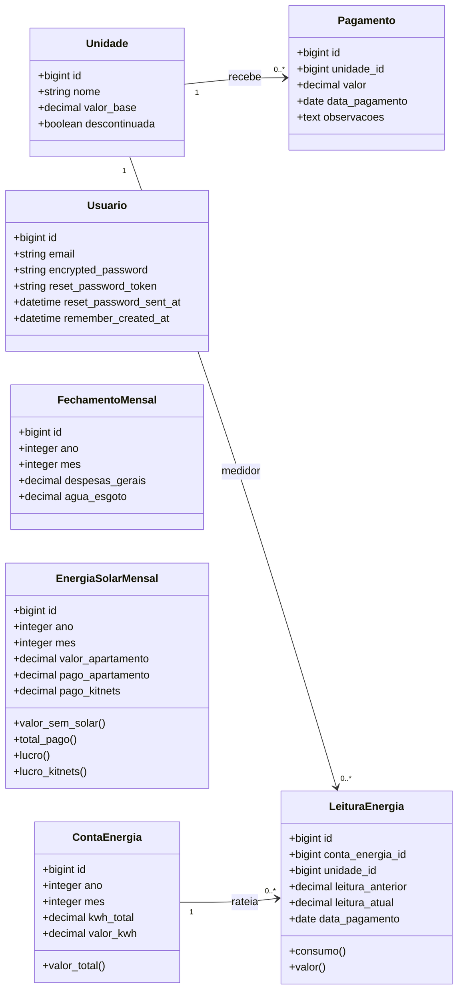

# Kitnet

Sistema web para a gestão financeira de 12 kitnets de aluguel: pagamentos recebidos, custos do mês, conta de energia com medidores por kitnet e o lucro da energia solar.


## Índice

- [Funcionalidades](#funcionalidades)
- [Tecnologias](#tecnologias)
- [Modelo de dados](#modelo-de-dados)
- [Regras de negócio](#regras-de-negócio)
- [Começando](#começando)
- [Uso](#uso)
- [Qualidade e segurança](#qualidade-e-segurança)
- [Backup](#backup)
- [Deploy](#deploy)

## Funcionalidades

- **Pagamentos** (página inicial): os aluguéis recebidos no mês, por kitnet, com quem já pagou e quem falta entre as kitnets com valor base; cada pagamento tem valor (sugerido pelo valor base da kitnet), data e observações
- **Kitnets**: as 12 kitnets fixas, por andar, mais a antiga casa (descontinuada, para os pagamentos do passado), com valor base e o histórico de pagamentos de cada uma
- **Finanças**: quanto foi recebido em cada mês do ano escolhido, comparado com os meses anteriores; por mês, lança despesas gerais e água e esgoto e soma o lucro da energia solar para chegar ao resultado
- **Energia**: conta de energia do mês (kWh total e tarifa do kWh; o valor total é calculado) e, por kitnet, a leitura do medidor, o consumo, o valor a cobrar e se já foi pago
- **Energia solar**: quanto a energia custaria sem os painéis (conta das kitnets + apartamento), menos o que foi realmente pago; mostra o lucro da energia solar das kitnets e o lucro total do mês
- **Autenticação** de usuários (Devise) e **autorização** por políticas (Pundit), sem cadastro público
- **Minha conta**: troca de e-mail e senha pelo próprio usuário, com login lembrado por 1 ano
- Interface responsiva com modo escuro

## Tecnologias

| Camada         | Ferramenta                                  |
| -------------- | ------------------------------------------- |
| Linguagem      | Ruby 3.4.10                                 |
| Framework      | Rails 8.1                                   |
| Banco de dados | SQLite                                      |
| Frontend       | Hotwire (Turbo + Stimulus), Importmap       |
| Estilo         | Tailwind CSS                                |
| Autenticação   | Devise (+ devise-i18n)                      |
| Autorização    | Pundit                                      |
| Infra Rails    | Solid Queue, Solid Cache, Solid Cable       |
| Deploy         | Kamal + Thruster (Docker)                   |

## Modelo de dados



> Todas as tabelas também possuem `created_at` e `updated_at`. `Usuario` é independente das demais entidades e serve apenas para autenticação. `FechamentoMensal` guarda os custos lançados em cada mês da página Finanças, e `ContaEnergia` e `EnergiaSolarMensal` os valores de energia; todos têm um registro por ano e mês.

## Regras de negócio

- **Kitnets são fixas**: as 12 (`001`–`004`, `101`–`104`, `201`–`204`) e a **Antiga casa** vêm do seed; no app só se altera o valor base. A Antiga casa é `descontinuada`: não é mais alugada, aceita pagamentos com datas do passado, aparece separada no quadro e some das telas mensais depois do mês do último pagamento.
- **Pagamento** pertence a uma kitnet e tem valor maior que zero e data de pagamento obrigatória, que não pode ser no futuro. O valor vem preenchido com o valor base da kitnet e pode ser ajustado.
- **Pagamentos do mês**: uma kitnet conta como paga no mês se tiver ao menos um pagamento com data naquele mês; "faltam pagar" lista as kitnets **com valor base** sem pagamento (kitnet sem valor base não é cobrada).
- **Energia**: a tarifa do kWh é digitada (sem o desconto da energia solar) e o valor total da conta = kWh total × tarifa; consumo da kitnet = leitura atual − leitura anterior (que vem do mês passado); valor da kitnet = consumo × valor do kWh. A diferença entre a conta e a soma dos medidores aparece como áreas comuns e perdas.
- **Lucro total da energia solar** = (conta das kitnets pela tarifa + energia do apartamento) − (conta paga do apartamento + conta paga das kitnets).
- **Lucro da energia solar das kitnets** = conta das kitnets pela tarifa − conta paga das kitnets. É este valor que entra em Finanças na coluna Energia solar.
- **Resultado do mês** (Finanças) = recebido + energia solar − despesas gerais − água e esgoto. Os custos não podem ser negativos.

## Começando

### Pré-requisitos

- Ruby 3.4.10
- SQLite 3
- Bundler

### Instalação

```bash
git clone https://github.com/keandro/kitnet.git
cd kitnet
bin/setup
```

O `bin/setup` instala as dependências, prepara o banco de dados e inicia o servidor. Para apenas preparar o ambiente sem subir o servidor:

```bash
bin/setup --skip-server
```

### Dados iniciais

O seed cria as 12 kitnets (`001`–`004`, `101`–`104`, `201`–`204`) e a Antiga casa e, se o banco ainda não tiver nenhum usuário, o administrador:

```bash
bin/rails db:seed
```

| Variável         | Padrão               |
| ---------------- | -------------------- |
| `ADMIN_EMAIL`    | `admin@kitnet.local` |
| `ADMIN_PASSWORD` | `senha123456`        |

> Troque a senha padrão logo no primeiro acesso, em **Minha conta** (`/conta/edit`).

Não existe cadastro público. Para criar outro usuário, use o console:

```bash
bin/rails runner 'Usuario.create!(email: "outro@exemplo.com", password: "uma-senha-forte")'
```

## Uso

Inicie o servidor de desenvolvimento (Rails + watcher do Tailwind):

```bash
bin/dev
```

Acesse <http://localhost:3000> e entre com o usuário administrador.

| Rota             | Descrição                         |
| ---------------- | --------------------------------- |
| `/`              | Pagamentos do mês                 |
| `/kitnets`       | Kitnets e histórico de pagamentos |
| `/financas`      | Finanças por ano                  |
| `/energia`       | Conta de energia e medidores      |
| `/energia-solar` | Lucro da energia solar            |
| `/conta/edit`    | Minha conta (e-mail e senha)      |
| `/up`            | Health check                      |

## Qualidade e segurança

```bash
bin/rubocop          # lint
bin/brakeman         # análise estática de segurança
bin/bundler-audit    # vulnerabilidades em gems
bin/importmap audit  # vulnerabilidades em pacotes JS
```

Esses mesmos passos rodam no GitHub Actions a cada push na `main` e em pull requests (`.github/workflows/ci.yml`).

## Backup

O banco de dados é um único arquivo SQLite dentro de `storage/`:

| Ambiente        | Arquivo                         |
| --------------- | ------------------------------- |
| Desenvolvimento | `storage/development.sqlite3`   |
| Produção        | `storage/production.sqlite3`    |

Para fazer backup com segurança, mesmo com o app rodando:

```bash
sqlite3 storage/development.sqlite3 ".backup 'kitnet-$(date +%F).sqlite3'"
```

## Deploy

O projeto está configurado para deploy com [Kamal](https://kamal-deploy.org) usando a imagem definida no `Dockerfile`:

```bash
bin/kamal setup   # primeiro deploy
bin/kamal deploy  # deploys seguintes
```

As configurações ficam em `config/deploy.yml` e os segredos em `.kamal/secrets`.
