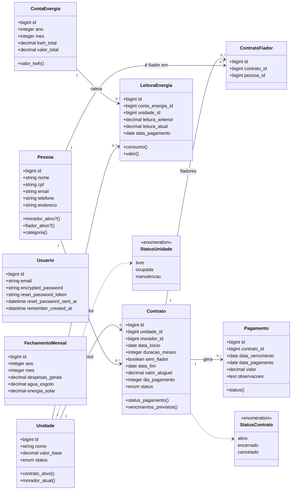

# Kitnet

Sistema web para gestão de kitnets de aluguel: cadastro de unidades, pessoas (moradores e fiadores), contratos e pagamentos, com painel de acompanhamento de ocupação e inadimplência.


## Índice

- [Funcionalidades](#funcionalidades)
- [Tecnologias](#tecnologias)
- [Modelo de dados](#modelo-de-dados)
- [Regras de negócio](#regras-de-negócio)
- [Começando](#começando)
- [Uso](#uso)
- [Qualidade e segurança](#qualidade-e-segurança)
- [Backup](#backup)
- [Deploy](#deploy)

## Funcionalidades

- **Vencimentos**: painel com ocupação, pagamentos vencidos e os que vencem no próximo mês
- **Finanças**: quanto foi recebido em cada mês do ano escolhido, comparado com os meses anteriores e com o previsto; por mês, lança despesas gerais e água e esgoto (e, em breve, energia solar) para chegar ao resultado
- **Quadro de kitnets** mostrando cada unidade, seu status e morador atual
- **Energia**: conta de energia do mês (kWh total, valor total e valor do kWh) e, por kitnet, a leitura do medidor, o consumo, o valor a cobrar e se já foi pago
- **Unidades**: cadastro com valor base e status (`livre`, `ocupada`, `manutenção`)
- **Pessoas**: cadastro de moradores e fiadores com validação de CPF
- **Contratos**: vínculo entre unidade, morador e um ou mais fiadores (ou sem fiador)
- **Ordens de pagamento**: geradas automaticamente ao criar o contrato (uma por mês), editáveis para incluir juros ou multa e quitadas com um clique na página do contrato; status `pago`, `pendente` ou `vencido`
- **Autenticação** de usuários (Devise) e **autorização** por políticas (Pundit), sem cadastro público
- **Minha conta**: troca de e-mail e senha pelo próprio usuário, com login lembrado por 1 ano
- Interface responsiva com modo escuro

## Tecnologias

| Camada         | Ferramenta                                  |
| -------------- | ------------------------------------------- |
| Linguagem      | Ruby 3.4.10                                 |
| Framework      | Rails 8.1                                   |
| Banco de dados | SQLite                                      |
| Frontend       | Hotwire (Turbo + Stimulus), Importmap       |
| Estilo         | Tailwind CSS                                |
| Autenticação   | Devise (+ devise-i18n)                      |
| Autorização    | Pundit                                      |
| Infra Rails    | Solid Queue, Solid Cache, Solid Cable       |
| Deploy         | Kamal + Thruster (Docker)                   |

## Modelo de dados



> Todas as tabelas também possuem `created_at` e `updated_at`. `Usuario` é independente das demais entidades e serve apenas para autenticação. `FechamentoMensal` guarda os custos lançados em cada mês da página Finanças (um registro por ano e mês).

## Regras de negócio

- **Contrato** exige data de início, duração em meses (1 a 120), valor de aluguel maior que zero, dia de pagamento entre 1 e 31 e **pelo menos um fiador**, a menos que seja marcado como **sem fiador**. A data de fim é calculada a partir do início e da duração.
- **Ordens de pagamento** são criadas junto com o contrato: uma por mês, a partir do mês de início, no dia de pagamento (limitado ao último dia em meses curtos). Ordens já pagas nunca são alteradas automaticamente. Ao editar o contrato:
  - mudar a **duração** cria ou remove ordens em aberto;
  - mudar o **dia de pagamento** move as ordens em aberto para o novo dia;
  - mudar o **valor do aluguel** atualiza as ordens futuras em aberto que ainda têm o valor antigo (as editadas à mão, com juros, ficam como estão);
  - **encerrar ou cancelar** remove as ordens futuras em aberto; as vencidas continuam como dívida.
- **Excluir um contrato** exclui todas as suas ordens de pagamento.
- **Energia**: valor do kWh = valor total ÷ kWh total da conta; consumo da kitnet = leitura atual − leitura anterior (que vem do mês passado); valor da kitnet = consumo × valor do kWh. A diferença entre a conta e a soma dos medidores aparece como áreas comuns e perdas.
- **Resultado do mês** (Finanças) = recebido + energia solar − despesas gerais − água e esgoto. Os custos não podem ser negativos.
- **Uma kitnet só pode ter um contrato ativo por vez.** Para criar (ou reativar) um contrato numa kitnet ocupada, encerre ou cancele antes o contrato atual. No formulário, as kitnets ocupadas aparecem desabilitadas.
- **O status de uma kitnet com contrato ativo não pode ser alterado à mão**: ela fica `ocupada` até o contrato ser encerrado, cancelado ou excluído.
- **Status da unidade** é sincronizado automaticamente com os contratos: fica `ocupada` quando há contrato ativo e volta a `livre` quando o último contrato ativo é encerrado, cancelado ou excluído. Unidades em `manutencao` não são alteradas automaticamente.
- **Pagamento** é `pago` quando tem data de pagamento, `vencido` quando passou do vencimento sem pagamento e `pendente` nos demais casos. A data de pagamento não pode ser futura.
- **Pessoa** tem CPF único com 11 dígitos (a máscara é removida automaticamente) e é classificada como `morador`, `fiador`, `ambos` ou `sem_contrato_ativo`.
- Não é possível excluir uma unidade ou um morador que possua contratos vinculados.

## Começando

### Pré-requisitos

- Ruby 3.4.10
- SQLite 3
- Bundler

### Instalação

```bash
git clone https://github.com/keandro/kitnet.git
cd kitnet
bin/setup
```

O `bin/setup` instala as dependências, prepara o banco de dados e inicia o servidor. Para apenas preparar o ambiente sem subir o servidor:

```bash
bin/setup --skip-server
```

### Dados iniciais

O seed cria um usuário administrador e as 12 unidades (`001`–`004`, `101`–`104`, `201`–`204`):

```bash
bin/rails db:seed
```

| Variável         | Padrão               |
| ---------------- | -------------------- |
| `ADMIN_EMAIL`    | `admin@kitnet.local` |
| `ADMIN_PASSWORD` | `senha123456`        |

> Troque a senha padrão logo no primeiro acesso, em **Minha conta** (`/conta/edit`).

Não existe cadastro público. Para criar outro usuário, use o console:

```bash
bin/rails runner 'Usuario.create!(email: "outro@exemplo.com", password: "uma-senha-forte")'
```

## Uso

Inicie o servidor de desenvolvimento (Rails + watcher do Tailwind):

```bash
bin/dev
```

Acesse <http://localhost:3000> e entre com o usuário administrador.

| Rota          | Descrição               |
| ------------- | ----------------------- |
| `/`           | Vencimentos             |
| `/financas`   | Finanças por ano        |
| `/energia`    | Conta de energia e medidores |
| `/kitnets`    | Quadro de unidades      |
| `/unidades`   | Gestão de unidades      |
| `/pessoas`    | Moradores e fiadores    |
| `/contratos`  | Contratos               |
| `/conta/edit` | Minha conta (e-mail e senha) |
| `/up`         | Health check            |

## Qualidade e segurança

```bash
bin/rubocop          # lint
bin/brakeman         # análise estática de segurança
bin/bundler-audit    # vulnerabilidades em gems
bin/importmap audit  # vulnerabilidades em pacotes JS
```

Esses mesmos passos rodam no GitHub Actions a cada push na `main` e em pull requests (`.github/workflows/ci.yml`).

## Backup

O banco de dados é um único arquivo SQLite dentro de `storage/`:

| Ambiente        | Arquivo                         |
| --------------- | ------------------------------- |
| Desenvolvimento | `storage/development.sqlite3`   |
| Produção        | `storage/production.sqlite3`    |

Para fazer backup com segurança, mesmo com o app rodando:

```bash
sqlite3 storage/development.sqlite3 ".backup 'kitnet-$(date +%F).sqlite3'"
```

## Deploy

O projeto está configurado para deploy com [Kamal](https://kamal-deploy.org) usando a imagem definida no `Dockerfile`:

```bash
bin/kamal setup   # primeiro deploy
bin/kamal deploy  # deploys seguintes
```

As configurações ficam em `config/deploy.yml` e os segredos em `.kamal/secrets`.
